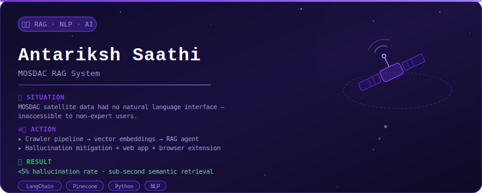
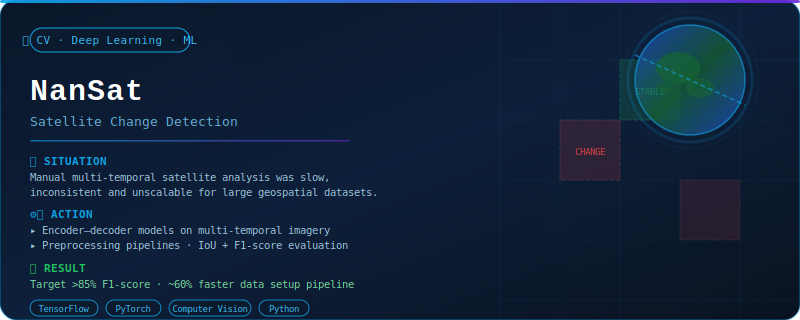
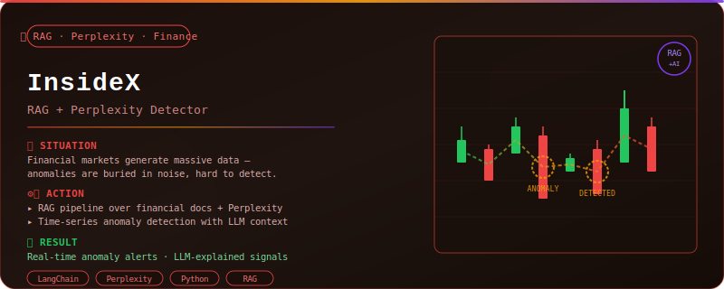
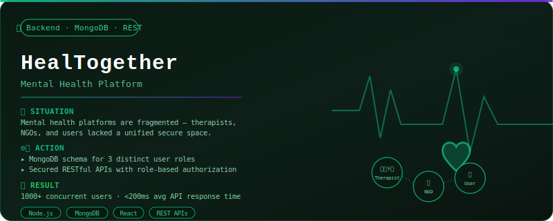
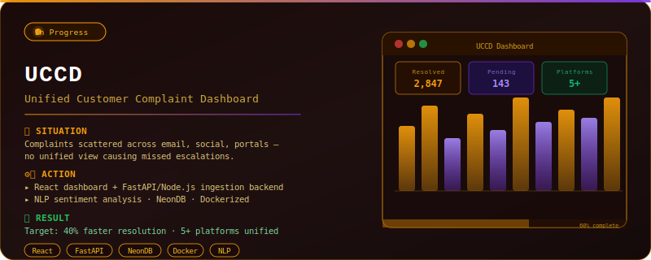

<p align="center">
  
</p>

<p align="center">
  <a href="https://linkedin.com/in/abhineet18">
    
  </a>
  &nbsp;
  <a href="https://github.com/RICH-KEED">
    
  </a>
  &nbsp;
  <a href="https://github.com/RICH-KEED?tab=followers">
    
  </a>
  &nbsp;
  
</p>


<table width="100%">
<tr>
<td valign="top" width="58%">

### 👨‍💻 About Me

I'm an AI/ML engineer on **Team Hail HYDRA**, obsessed with building systems that bridge the gap between cutting-edge research and things that actually ship.

Currently deep in **RAG architectures** and **backend infrastructure** — the kind of work where a wrong vector index costs you a hackathon placing.

When I'm not coding, I'm competing. Top 10 among **1,800 teams** at IIT Ropar's Gen AI Hackathon. Selected for **ISRO's Bharatiya Antariksh Hackathon 2025**. Winner at **House of Turing**.

<br>

> *"I don't just build demos — I build systems."*

</td>
<td valign="top" width="42%">

### ⚡ Quick Profile

```yaml
name      : Abhineet
handle    : RICH-KEED
team      : Hail HYDRA
focus     : RAG · CV · Backend
currently : Architecting @ scale
open_to   : Collabs & Hackathons
```

- 🔭 &nbsp;Building RAG systems for real-world data
- 🌱 &nbsp;Exploring agentic AI & multi-modal LLMs
- ⚡ &nbsp;Competing in national-level hackathons
- 💬 &nbsp;Ask me about LLMs, FastAPI, vector DBs

</td>
</tr>
</table>


<h2 align="center">🛠️ Tech Stack</h2>

<div align="center">

**Languages**


<br>

**Frameworks · Infrastructure · Tools**


<br>

**AI / ML Ecosystem**


&nbsp;

&nbsp;

&nbsp;

&nbsp;


</div>


<h2 align="center">📊 GitHub Stats</h2>

<br>

<div align="center">
  
</div>

<br>

<div align="center">
  
</div>


<h2 align="center">🚀 Featured Projects</h2>

<br>

<a href="https://github.com/RICH-KEED/BAH-CHAT-WEB">
  
</a>

<br><br>



<br><br>

<a href="https://github.com/RICH-KEED/INSIDEX-FULL">
  
</a>

<br><br>

<a href="https://github.com/RICH-KEED/HealTogether">
  
</a>

<br><br>

<a href="https://github.com/RICH-KEED/UCCD">
  
</a>


<h2 align="center">🏆 Achievements</h2>

<br>

<div align="center">
<table>
  <thead>
    <tr>
      <th>Placing</th>
      <th>Event</th>
      <th>Scale</th>
    </tr>
  </thead>
  <tbody>
    <tr>
      <td>🥇&nbsp; Winner</td>
      <td>House of Turing Hackathon</td>
      <td>—</td>
    </tr>
    <tr>
      <td>🚀&nbsp; Top 10</td>
      <td>IIT Ropar Gen AI Hackathon</td>
      <td>1,800 teams</td>
    </tr>
    <tr>
      <td>🛰️&nbsp; Selected</td>
      <td>ISRO Bharatiya Antariksh Hackathon 2025</td>
      <td>National</td>
    </tr>
    <tr>
      <td>🏗️&nbsp; Top 10</td>
      <td>Project Expo 2024</td>
      <td>—</td>
    </tr>
    <tr>
      <td>⚡&nbsp; Top 30</td>
      <td>Zinnovatio 2.0</td>
      <td>—</td>
    </tr>
  </tbody>
</table>
</div>


<h2 align="center">🐍 Contribution Snake</h2>

<br>

<div align="center">
  <picture>
    <source media="(prefers-color-scheme: dark)" srcset="https://raw.githubusercontent.com/RICH-KEED/RICH-KEED/output/github-contribution-grid-snake-dark.svg"/>
    <source media="(prefers-color-scheme: light)" srcset="https://raw.githubusercontent.com/RICH-KEED/RICH-KEED/output/github-contribution-grid-snake.svg"/>
    
  </picture>
</div>


<p align="center">
  <i>"Consistency beats talent when talent doesn't show up."</i>
  <br><br>
  <b>Let's connect →</b>&nbsp;
  <a href="https://linkedin.com/in/abhineet18">LinkedIn</a>
  &nbsp;·&nbsp;
  <a href="https://github.com/RICH-KEED">GitHub</a>
</p>

<br>


